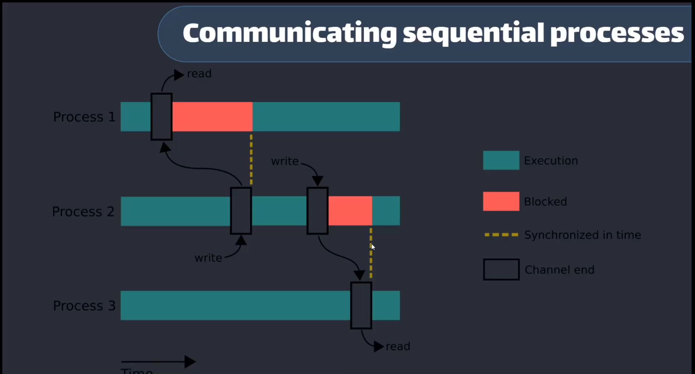
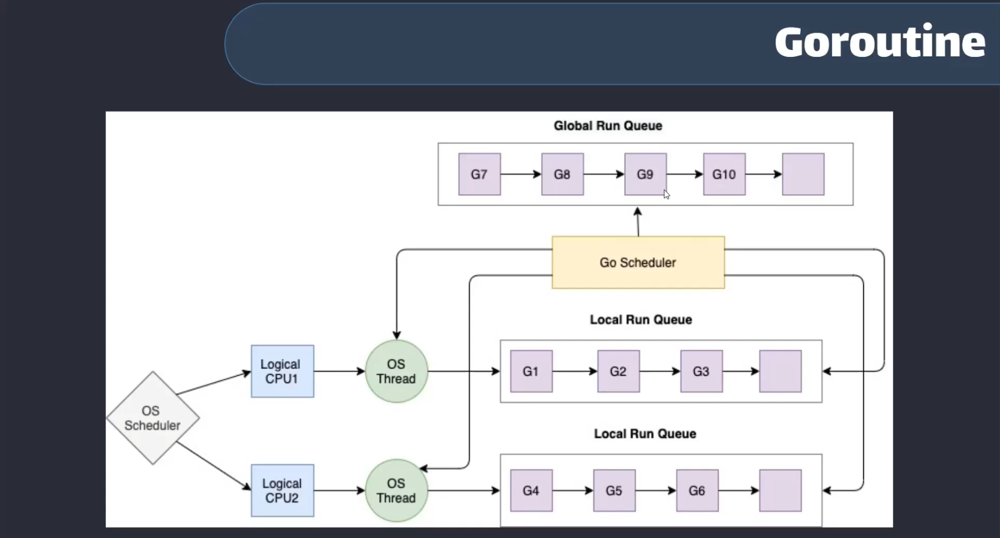

<div dir="rtl">

# فصل ۱ — مقدمه‌ای بر Concurrency در Go

قبل از ورود به مبحث `goroutine` و `channel` لازم است درک محکمی از مفهوم Concurrency داشته باشیم و بدانیم چرا زبان Go از ابتدا با تمرکز بر این مدل طراحی شده است.  
در این فصل درباره اهمیت Concurrency، تفاوت آن با Parallelism، مدل CSP، نحوه کار Runtime و Scheduler (مدل G-M-P) صحبت می‌کنیم.

---

## چرا Concurrency مهم است؟

بیشتر برنامه‌های مدرن باید چند کار را همزمان انجام دهند. مثال‌ها:

- یک وب‌سرور باید به هزاران درخواست همزمان پاسخ دهد.
- یک سیستم پردازش داده باید چند فایل یا stream را همزمان پردازش کند.
- یک crawler باید چند صفحه وب را موازی دانلود کند.
- یک سرویس باید همزمان با دیتابیس، cache و APIهای خارجی تعامل داشته باشد.

اگر این کارها به صورت **sequential** انجام شوند، برنامه به شدت کند و غیرمقیاس‌پذیر خواهد شد.

### Concurrency چه مزایایی دارد؟

- استفاده بهتر از منابع سیستم
- کاهش latency
- افزایش throughput
- قابلیت scale بهتر
- طراحی ماژولار و ساده‌تر وظایف مستقل

Go از ابتدا برای ساخت سیستم‌های concurrent طراحی شد؛ به همین دلیل ابزارهای آن ساده و بسیار قدرتمند هستند.

---

## تفاوت Concurrency و Parallelism

خیلی وقت‌ها این دو اصطلاح با هم اشتباه گرفته می‌شوند.

- **Concurrency** یعنی مدیریت چند کار در یک بازه زمانی
- **Parallelism** یعنی اجرای واقعی چند کار در یک زمان

### مثال آشپزی:

**Sequential:**  
اول برنج، بعد خورشت، بعد سالاد.

**Concurrency:**  
برنج روی گاز است، همزمان خورشت تهیه می‌شود و سالاد آماده می‌شود.

**Parallelism:**  
چند آشپز در یک زمان کار می‌کنند.

### خلاصه تفاوت:

- Concurrency یک **مدل طراحی نرم‌افزار** است.
- Parallelism مربوط به **سخت‌افزار و CPU چند هسته‌ای** است.
- در Go شما Concurrency می‌نویسید؛ runtime تصمیم می‌گیرد parallel اجرا شود یا خیر.

---

## مدل CSP در Go (Communicating Sequential Processes)

مدل concurrency در Go از CSP الهام گرفته است.

**ایده اصلی CSP:**

«به جای اشتراک‌گذاری حافظه برای ارتباط، با ارتباط برقرار کردن حافظه را به اشتراک بگذار.»

در Go این مفهوم با دو ابزار کلیدی پیاده‌سازی شده است:

- **Goroutine**
- **Channel**

به این ترتیب:

- race condition کمتر
- synchronization ساده‌تر
- کد قابل فهم‌تر و maintainable‌تر

---

## مروری بر Runtime زبان Go

Go فقط از سیستم‌عامل برای concurrency استفاده نمی‌کند.  
یک **runtime** اختصاصی دارد که وظایف زیر را مدیریت می‌کند:

- ایجاد و کنترل گوروتین‌ها
- زمان‌بندی و اجرای آنها
- مدیریت حافظه و Garbage Collector
- مدیریت network I/O
- Work-stealing و load-balancing داخلی

### سبک بودن Goroutine

گوروتین‌ها بسیار سبک هستند:

- stack اولیه ~۲KB
- ایجاد میلیون‌ها گوروتین قابل انجام است

در مقابل، threadهای سیستم‌عامل بسیار سنگین‌ترند.

---

## مدل Scheduler در Go و معماری G‑M‑P

Scheduler داخلی Go از مدل G‑M‑P استفاده می‌کند.

### اجزای مدل:

- **G — Goroutine**  
  واحد اجرای سبک (task)

- **M — Machine**  
  یک thread واقعی سیستم‌عامل

- **P — Processor**  
  یک context منطقی که صف goroutineها و اجرای آنها را مدیریت می‌کند

### جریان کار:

1. گوروتین‌ها در صف‌های مرتبط با P قرار می‌گیرند
2. هر P به یک Thread (یا M) وصل می‌شود
3. Thread روی CPU اجرا می‌شود

به صورت ساده:
goroutine → scheduler → OS thread → CPU


تعداد Pها معمولاً برابر `GOMAXPROCS` است.

---

## چه زمانی نباید از Concurrency استفاده کرد؟

Concurrency همیشه بهترین انتخاب نیست.

زمان‌هایی که نباید از آن استفاده کرد:

- پردازش‌های بسیار کوتاه و ساده
- الگوریتم‌هایی که کاملاً ترتیبی هستند
- برنامه‌هایی با I/O بسیار کم
- زمانی که overhead ایجاد goroutine بیشتر از سود آن است

استفاده‌ی بی‌جا باعث:

- پیچیدگی کد
- سخت‌تر شدن debugging
- احتمال افزایش race condition
- احتمال deadlock
- ایجاد goroutine leak

### اصل مهم طراحی:

**اول ساده بنویس—در صورت نیاز concurrent کن.**

---

## نتیجه‌گیری این فصل

در این فصل با مفاهیم بنیادی زیر آشنا شدیم:

- اهمیت Concurrency
- تفاوت Concurrency با Parallelism
- مدل CSP و نقش goroutine و channel
- نحوه کار runtime و scheduler
- معماری G‑M‑P
- زمان‌هایی که نباید از concurrency استفاده کرد

در فصل بعد وارد مباحث عملی‌تری مثل **goroutine** و **channel** می‌شویم و اولین برنامه concurrent خود را می‌نویسیم.

---

## نمودار مدل G‑M‑P

نمودار زیر نشان می‌دهد چگونه goroutineها (G) روی processorها (P) صف شده و توسط threadهای سیستم‌عامل (M) اجرا می‌شوند:


---

## مثال: مقایسه اجرای Concurrent و Sequential

مثال زیر نشان می‌دهد چگونه concurrency می‌تواند زمان کل اجرای عملیات‌های I/O را کاهش دهد:


---

## Pitfalls رایج (اشتباهات متداول)

- استفاده از `go` برای هر کار کوچکی
- عدم مدیریت عمر گوروتین → ایجاد Goroutine Leak
- Shared State بدون همگام‌سازی → Data Race
- فرض ترتیب اجرا → concurrency ترتیب ندارد


# دیگر موارد 

### Communication Sequential Processes


---


# درک کامل مدل G‑M‑P و رفتار Scheduler در Go

برای درک عمیق مدل هم‌زمانی در Go و اینکه چرا می‌تواند میلیون‌ها گوروتین را با تنها چند Thread واقعی مدیریت کند، باید سه لایه اصلی را بشناسیم:

1. لایه سیستم‌عامل
2. لایه Processor (P) در فضای کاربر
3. لایه Goroutine و صف‌های اجرای Go

# ۱. لایه سیستم‌عامل (OS Layer)

در پایین‌ترین سطح، Go برای اجرای کدها از Threadهای واقعی سیستم‌عامل استفاده می‌کند.

## OS Scheduler
این بخش از Kernel وظیفه دارد Threadها را روی هسته‌های پردازنده قرار دهد.  
هر Thread ممکن است در هر لحظه روی هر هسته CPU جابه‌جا شود.

## Logical CPU
نمایانگر هسته‌های پردازنده هستند.  
اگر CPU شما ۸ هسته فیزیکی / منطقی داشته باشد، OS می‌تواند ۸ Thread را به صورت هم‌زمان روی آنها اجرا کند.

## OS Thread (M)
دایره‌های سبز رنگ در تصویر نمایانگر **M**ها هستند.  
هر *M (Machine)* یک Thread واقعی از سیستم‌عامل است.

### چرا Threadهای OS گران (Expensive) هستند؟
- ساختنشان هزینه دارد
- Stack آنها بزرگ است
- جابه‌جایی بین آنها (Context Switch) باید وارد Kernel شود
- مدیریت‌شان سنگین است

به همین دلیل Go از Threadها مستقیماً برای اجرای هر کار کوچک استفاده نمی‌کند.

---

# ۲. لایه Processor (P) — مدیریت محلی در Go

Go یک لایه بالاتر از OS ایجاد کرده تا زمان‌بندی را **در فضای کاربر (User-space)** انجام دهد.  
این لایه همان **P (Processor)** است.

## Processor (P) چیست؟
یک ساختار منطقی که:
- صف محلی گوروتین‌ها را نگه می‌دارد
- تصمیم می‌گیرد چه گوروتینی بعدی اجرا شود
- در اختیار یک Thread (M) قرار می‌گیرد

تعداد Pها معمولاً برابر مقدار `GOMAXPROCS` است.

### چرا P مهم است؟
چون زمان‌بندی در سطح Go انجام می‌شود، نه در OS.  
این یعنی:
- سوییچ بین گوروتین‌ها نیاز به ورود به Kernel ندارد
- سرعت بسیار بالاتر می‌رود
- Lockهای سنگین حذف می‌شود

## Local Run Queue (LRQ)
هر P یک صف محلی دارد که گوروتین‌ها در آن قرار می‌گیرند:  
`G1 → G2 → G3 → ...`

### چرا صف محلی؟
اگر یک صف global داشتیم:
- هر Thread برای دسترسی باید Lock می‌گرفت
- برنامه به سرعت کند می‌شد
- Contention شدید ایجاد می‌شد

صف محلی مشکل Lock را حل می‌کند.

---

# ۳. لایه Goroutine و Global Queue

## Goroutine (G)
کوچک‌ترین واحد اجرا در Go.

ویژگی‌ها:
- Stack کوچک (شروع از ~۲KB)
- قابل رشد پویا
- بسیار سبک‌تر از OS Thread

## Global Run Queue (GRQ)
وقتی یک گوروتین:
- از خارج وارد شود
- صف محلی جا نداشته باشد

به صف‌ی که در سطح جهانی وجود دارد فرستاده می‌شود.

Scheduler با توجه به نیاز، Gها را از GRQ به LRQ منتقل می‌کند.

---

# ۴. رفتارهای داخلی و کلیدی Scheduler

در این بخش قدرت واقعی Scheduler Go را می‌بینیم.

---

## الف) Work Stealing (سرقت کار)

اگر یک P کارش تمام شود:

- به سراغ صف محلی Pهای دیگر می‌رود
- **نیمی** از گوروتین‌ها را می‌دزدد
- اگر همه خالی بودند، به GRQ مراجعه می‌کند

### نتیجه:
هیچ هسته CPU بیکار نمی‌ماند.

---

## ب) Hand‑off (تحویل P به Thread دیگر)

اگر یک گوروتین:
- Syscall طولانی انجام دهد
- مثل خواندن فایل یا عملیات شبکه بلاک شود

Thread (M) بلاک می‌شود.

Go Scheduler چه می‌کند؟

1. P را از M بلاک‌شده جدا می‌کند
2. آن را به یک M آزاد یا جدید وصل می‌کند

### نتیجه:
بقیه گوروتین‌ها (در صف محلی P) معطل نمی‌مانند.

---

## ج) Preemption (اجرای نوبتی)

اگر یک گوروتین مدت طولانی CPU را اشغال کند، Scheduler:

- آن را قطع می‌کند (Preempt)
- به انتهای صف می‌فرستد
- گوروتین‌های دیگر را اجرا می‌کند

این مکانیزم از نسخه Go 1.14 به بعد اضافه شد.

### نتیجه:
عدالت در اجرای گوروتین‌ها برقرار می‌شود.

---

# ۵. خلاصه جریان اجرای تصویر

بر اساس نمودار:

1. **OS Scheduler** تردهای واقعی (M) را روی CPUهای منطقی قرار می‌دهد.
2. هر **M** یک **P** را در اختیار می‌گیرد.
3. هر **P** یک صف محلی از گوروتین‌ها دارد.
4. **Go Scheduler** ارتباط بین GRQ و LRQها را مدیریت می‌کند.
5. Threadها (M) گوروتین‌ها را یکی‌یکی اجرا می‌کنند.

---

# ۶. نتیجه معماری Go

این معماری مزایای بسیار مهمی دارد:

### با تنها چند Thread واقعی (مثلاً ۸ تا)
می‌توانید:
- میلیون‌ها گوروتین ایجاد و اجرا کنید
- بدون نگرانی از هزینه ساخت Thread
- بدون context switchهای سنگین Kernel
- با کارایی بسیار بالا در User-space

این همان دلیلی است که Go برای برنامه‌های شبکه‌ای و سرویس‌های بزرگ یک زبان ایده‌آل است.


---


# آیا Goroutine خوب است یا بد؟

در این بخش قصد داریم تفاوت رفتار **Goroutine** با **OS Thread** را بررسی کنیم و ببینیم چرا Go می‌تواند با مصرف منابع بسیار کمتر، هزاران یا حتی میلیون‌ها کار هم‌زمان را مدیریت کند.

---

# ۱. نحوه زمان‌بندی Goroutine در Go

- **زمان‌بندی (Scheduling) گوروتین‌ها توسط Go Runtime انجام می‌شود.**
- Go Runtime به طور داخلی تعدادی **OS Thread** ایجاد می‌کند که معمولاً برابر با تعداد **CPU Logical** هستند.
- سپس Goroutineها به صورت سبک‌وزن روی این Threadها **Multiplex** می‌شوند.  
  یعنی چندین G روی یک M اجرا می‌شوند.
- از آنجا که **Go Scheduler** در فضای کاربر (User-space) کار می‌کند،  
  **زمان Context Switch بین گوروتین‌ها بسیار سریع‌تر از Threadهای OS است.**
- در مقابل، زمان‌بندی Threadهای OS کاملاً توسط **OS Scheduler** انجام می‌شود و هزینه زیادی دارد.

### نتیجه
Goroutine بسیار سریع‌تر، سبک‌تر و کم‌هزینه‌تر از OS Thread است.

---

# ۲. معماری Go Scheduler به‌صورت ساده

در معماری Go سه موجودیت کلیدی وجود دارد:

- **G** = Goroutine
- **M** = OS Thread (Machine)
- **P** = Processor (منابع منطقی برای اجرای Gها)

Go Scheduler گوروتین‌ها را دریافت کرده و آن‌ها را روی Pها قرار می‌دهد.  
Pها نیز توسط Mها (Threadهای واقعی OS) اجرا می‌شوند.  
OS نیز در نهایت Mها را روی CPU قرار می‌دهد.

این ساختار باعث می‌شود:
- استفاده از CPU بهینه باشد
- Threadهای OS کم و ثابت بمانند
- جابجایی‌ها سریع و سبک اجرا شوند

---

# ۳. چرا Goroutine بهتر از Thread است؟

اگر در زبان‌هایی مثل Java یا C# هزار Thread اجرا کنید:

- سیستم‌عامل باید **۱۰۰۰ Thread واقعی** ایجاد و مدیریت کند.
- هر Thread واقعی معمولاً **بیش از ۱ مگابایت** Stack نیاز دارد.
- Context Switch بین Threadها بسیار گران است.
- سربار OS Scheduler بسیار بالا می‌رود.

اما در Go:

- هر Goroutine تنها با **۲ KB Stack** شروع می‌شود.
- Stack رشد پویا دارد.
- زمان‌بندی در User‑space است → *بسیار سریع‌تر*.
- هزاران Goroutine فقط روی چند Thread واقعی اجرا می‌شوند.

### نتیجه نهایی:

**هزاران یا میلیون‌ها گوروتین → فقط روی چند Thread واقعی OS!**

این همان جایی است که Go می‌درخشد.

---

# ۴. جمع‌بندی مزایای مهم Goroutine

- بسیار سبک (Memory Footprint کوچک)
- زمان اجرای سریع و بدون درگیری با Kernel
- Context Switch سبک و مقرون‌به‌صرفه
- اجرای فوق‌العاده هم‌زمان و مقیاس‌پذیر
- ایجاد و نابودی بسیار سریع‌تر از Thread
- مناسب برای ساخت سرویس‌های شبکه‌ای و سیستم‌های High‑Concurrency

---

# مطالب اضافی
# 📘 README — بخش تکمیلی فصل ۱ (Concurrency در Go)


# بخش تکمیلی — مفاهیم پیشرفته Concurrency در Go

در این بخش ۱۳ مفهوم مهم و بنیادی را پوشش می‌دهیم که برای درک عمیق کار Scheduler، Memory Model و رفتار گوروتین‌ها در Go ضروری هستند.  
این بخش برای اضافه‌شدن به انتهای فصل اول طراحی شده است.

---

# ۱) Latency و Throughput

برای تحلیل و بهینه‌سازی برنامه‌های concurrent باید دو معیار بنیادین را بشناسیم:

### Latency (تأخیر)
مدت‌زمان انجام یک کار مشخص از شروع تا پایان.

مثال:  
پردازش یک درخواست HTTP در **۲۰ میلی‌ثانیه**.

### Throughput (توان عملیاتی)
تعداد کارهایی که در یک بازه زمانی مشخص انجام می‌شود.

مثال:  
یک سرور می‌تواند **۵۰۰۰ درخواست در ثانیه** پردازش کند.

### نکته مهم
- Concurrency معمولاً **Throughput را افزایش می‌دهد**
- Concurrency **لزماً Latency را کاهش نمی‌دهد**
- اما در برخی معماری‌ها مثل Pipeline می‌تواند Latency را هم کاهش دهد

---

# ۲) Memory Model در Go

برای نوشتن برنامه‌های concurrent ایمن، باید Memory Model را بشناسیم.

### مفاهیم کلیدی

#### Happens-Before
مشخص می‌کند کدام عملیات باید قطعی قبل از عملیات دیگر دیده شود.  
مثال:  
ارسال روی channel همیشه قبل از دریافت مشاهده می‌شود.

#### Visibility
تغییرات حافظه در یک goroutine برای goroutine دیگر قابل مشاهده خواهد بود.

#### Atomicity
عملیات در یک گام غیرقابل تقسیم انجام می‌شود.  
در Go با پکیج **sync/atomic** تضمین می‌شود.

#### Channel Ordering Guarantee
Channelها:
- ترتیب قطعی برای داده ایجاد می‌کنند
- یک رابطه happens-before تضمینی تولید می‌کنند

---

# ۳) چرا Scheduler در Go یک M:N Scheduler است؟

Go تعداد زیادی **goroutine** (N)  
را روی تعداد کمی **thread سیستم‌عامل** (M)  
نگاشت می‌کند.

مزایا:

- کاهش context switch
- نیاز نداشتن به ساخت Thread جدید برای هر کار
- بهره‌گیری بهینه از CPU
- مقیاس‌پذیری بسیار بالا

این معماری اساس مدل G‑M‑P است.

---

# ۴) Blocking vs Non-Blocking در Goroutineها

Go طوری طراحی شده که **اگر یک goroutine بلاک شود، thread بلاک نشود.**

### انواع بلاکینگ:

- blocking syscall (مثل خواندن فایل)
- network blocking (مثل دریافت از socket)
- timer sleep (`time.Sleep`)
- channel blocking (`<-ch`)

### رفتار Runtime

اگر یک goroutine بلاک شود:

1. goroutine وارد حالت waiting می‌شود
2. Runtime یک thread جدید (M) برای ادامه اجرای P اختصاص می‌دهد
3. Scheduler اجازه نمی‌دهد بقیه goroutineها معطل شوند

---

# ۵) IO Multiplexing در Go

Go Runtime برای مدیریت I/O از مکانیزم‌های OS استفاده می‌کند:

- Linux → epoll
- BSD/macOS → kqueue
- Windows → IOCP

نتیجه:

- امکان مدیریت هزاران connection
- بدون ساخت هزاران thread
- بدون block شدن goroutineها

---

# ۶) sysmon و Background Tasks

`sysmon` یک goroutine ویژه و سیستمی در Runtime است.

### وظایف sysmon:

- **Preemption Monitoring**  
  اگر یک goroutine زیادی اجرا شود، preempt می‌شود.

- **Starvation Detection**  
  بررسی اینکه گوروتینی گرسنه (غیرقابل اجرا) نماند.

- **Timer Management**  
  مدیریت تایمرهای داخلی runtime.

- **Unblocking P**  
  آزادسازی P وقتی یک thread در syscall گیر کرده باشد.

---

# ۷) چرخه عمر و States گوروتین‌ها

هر goroutine در Runtime یکی از وضعیت‌های زیر را دارد:

- **_Gidle** → هنوز استفاده نشده
- **_Grunnable** → آماده اجرا
- **_Grunning** → در حال اجرا روی یک M
- **_Gwaiting** → منتظر I/O یا channel یا lock
- **_Gsyscall** → مشغول syscall
- **_Gdead** → تمام شده

در ابزارهایی مثل pprof دیدن این stateها بسیار مهم است.

---

# ۸) Work-Stealing — چرا نیمهٔ صف دزدیده می‌شود؟

در مدل Go:

- هر **P** یک صف محلی گوروتین دارد (LRQ)
- اگر یک P کار نداشته باشد، از دیگری «می‌دزدد»

### چرا نیمه صف؟

برای:

- توزیع بار بهتر
- جلوگیری از خالی شدن یک صف
- حفظ locality

### چرا فقط یک goroutine دزدیده نمی‌شود؟

این کار overhead زیادی ایجاد می‌کند و Load Balancing ضعیف می‌شود.

### چرا کل صف دزدیده نمی‌شود؟

باعث starvation می‌شود و locality از بین می‌رود.

---

# ۹) Fairness در Scheduler

Scheduler گو تضمین می‌کند که:

- هیچ گوروتینی برای همیشه منتظر نماند
- اجرای طولانی preempt شود
- تعادل بین صف محلی و سراسری رعایت شود

---

# ۱۰) Preemption و Latency Spikes

در نسخه‌های قبل از Go 1.14:

- preemption فقط در safepoint انجام می‌شد
- latency ممکن بود افزایش پیدا کند

در Go 1.14 به بعد:

- **asynchronous preemption** اضافه شد
- latency کاهش یافت
- رفتار scheduler پایدارتر شد

---

# ۱۱) Goroutine Leak — ابزارهای تشخیص

برای تشخیص نشت گوروتین‌ها از ابزارهای زیر استفاده می‌شود:

### race detector:
```text
go run -race
```


## 🔍 pprof

pprof برای تحلیل رفتار برنامه در زمان اجرا کاربرد دارد.

### امکانات مرتبط:
- **شمارش goroutines**
- **نمونه‌گیری heap/cpu**

برای فعال کردن پروفایل:
```bash
go tool pprof
```

## 🔍 pprof
یک ابزار تحلیل ایستا است.

###  کاربردها :
- **هشدار برای الگوهای اشتباه**
- **شناسایی pitfallهای مرتبط با concurrency**

نحوه اجرا:
```bash
go vet ./...
```


# ۲) Channel vs Mutex — کدام را انتخاب کنیم؟


Go از مدل **CSP** پشتیبانی می‌کند، اما همیشه بهترین انتخاب نیست.  
انتخاب بین *Channel* و *Mutex* کاملاً به **نوع کار** و **نوع داده** بستگی دارد.

---

## 🔵 Channel — مناسب برای انتقال داده

از Channel زمانی استفاده کن که:

- فقط می‌خواهی **داده بین گوروتین‌ها جابه‌جا شود**
- ساختار برنامه حالت **pipeline، fan‑in، fan‑out** دارد
- می‌خواهی **ترتیب جریان داده** حفظ شود

### موارد کاربرد:
- Pipeline
- Fan‑in
- Fan‑out

---

## 🔒 Mutex — مناسب برای محافظت از داده

از Mutex زمانی استفاده کن که:

- چند goroutine روی **یک دادهٔ مشترک (shared state)** کار می‌کنند
- نیاز به **بهبود عملکرد** داری و Channel سربار ایجاد می‌کند
- دسترسی **سریع، کوچک و atomic** لازم است

### موارد کاربرد:
- ساختار دادهٔ shared
- cache
- counter

</div>
