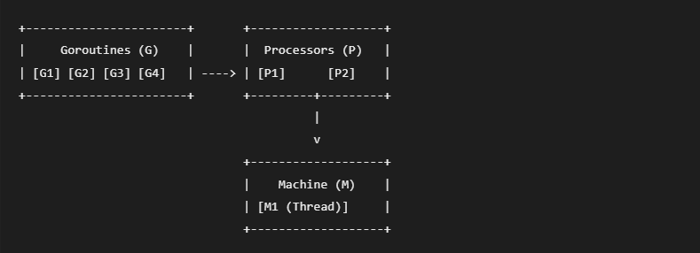
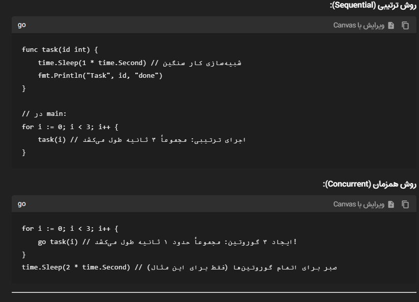

فصل ۱ — مقدمه‌ای بر Concurrency در Go
قبل از اینکه وارد goroutine و channel شویم، لازم است درک درستی از مفهوم Concurrency داشته باشیم و بدانیم چرا Go تا این حد روی آن تمرکز دارد. در این فصل درباره اهمیت concurrency، تفاوت آن با parallelism، مدل CSP در Go و همچنین نحوه کار runtime و scheduler صحبت می‌کنیم.

چرا Concurrency مهم است؟
بیشتر برنامه‌های مدرن باید چند کار را به طور همزمان انجام دهند. برای مثال:

یک وب‌سرور باید همزمان به هزاران درخواست پاسخ دهد
یک سیستم پردازش داده باید چندین فایل یا stream را همزمان پردازش کند
یک crawler باید همزمان چندین صفحه وب را دانلود کند
یک سرویس باید همزمان با دیتابیس، cache و APIهای دیگر ارتباط داشته باشد
اگر همه این کارها به صورت ترتیبی (sequential) انجام شوند، برنامه بسیار کند خواهد شد.

Concurrency به ما اجازه می‌دهد برنامه را به چندین کار مستقل تقسیم کنیم که می‌توانند همزمان پیش بروند. این کار باعث می‌شود:

منابع سیستم بهتر استفاده شوند
latency کاهش پیدا کند
throughput سیستم افزایش پیدا کند
برنامه‌ها مقیاس‌پذیرتر شوند
زبان Go از ابتدا با هدف ساخت سیستم‌های concurrent طراحی شده است. به همین دلیل ابزارهای concurrency در آن ساده و قدرتمند هستند.

تفاوت Concurrency و Parallelism
خیلی وقت‌ها این دو مفهوم با هم اشتباه گرفته می‌شوند، اما تفاوت مهمی دارند.

Concurrency یعنی مدیریت چند کار در یک بازه زمانی.

Parallelism یعنی اجرای واقعی چند کار در همان لحظه.

یک مثال ساده:

فرض کن یک آشپز در آشپزخانه کار می‌کند.

حالت اول:

او ابتدا برنج را می‌پزد، بعد خورشت را درست می‌کند، بعد سالاد را آماده می‌کند.

این حالت sequential است.

حالت دوم:

او برنج را روی گاز می‌گذارد، در حالی که برنج در حال پختن است خورشت را آماده می‌کند، و در همین زمان سالاد را هم درست می‌کند.

این concurrency است.

حالت سوم:

چند آشپز همزمان در آشپزخانه کار می‌کنند.

این parallelism است.

نکته مهم:

Concurrency بیشتر یک مدل طراحی نرم‌افزار است.

Parallelism بیشتر به سخت‌افزار و CPUهای چند هسته‌ای مربوط می‌شود.

در Go شما concurrency می‌نویسید و runtime تصمیم می‌گیرد آیا آن را به صورت parallel اجرا کند یا نه.

مدل CSP در Go (Communicating Sequential Processes)
مدل concurrency در Go بر اساس مفهومی به نام CSP طراحی شده است.

CSP مخفف:

Communicating Sequential Processes

این مدل اولین بار توسط Tony Hoare معرفی شد.

ایده اصلی CSP این جمله معروف است:

Do not communicate by sharing memory; instead, share memory by communicating.

یعنی:

به جای اینکه چند thread به یک حافظه مشترک دسترسی داشته باشند،

بهتر است داده‌ها را از طریق پیام‌رسانی (message passing) منتقل کنند.

در Go این مدل با دو ابزار پیاده‌سازی شده است:

Goroutines
Channels
goroutine ها کارها را اجرا می‌کنند و channel ها داده‌ها را بین آنها منتقل می‌کنند.

این رویکرد باعث می‌شود:

race condition کمتر شود
synchronization ساده‌تر شود
کد قابل فهم‌تر باشد
مروری بر Runtime زبان Go
برخلاف بسیاری از زبان‌ها، concurrency در Go فقط به سیستم عامل وابسته نیست.

Go یک runtime قدرتمند دارد که مدیریت concurrency را انجام می‌دهد.

وظایف runtime شامل:

مدیریت goroutine ها
زمان‌بندی اجرای آنها
مدیریت حافظه (Garbage Collector)
scheduling روی CPUها
مدیریت network I/O
یکی از مزیت‌های بزرگ Go این است که goroutine ها خیلی سبک هستند.

تقریباً می‌توان هزاران یا حتی میلیون‌ها goroutine ایجاد کرد، در حالی که threadهای سیستم عامل بسیار سنگین‌تر هستند.

آشنایی با Scheduler و مدل G-M-P
Go برای اجرای goroutine ها از یک scheduler داخلی استفاده می‌کند.

مدل scheduling در Go با نام G-M-P شناخته می‌شود.

سه جزء اصلی آن:

G — Goroutine
نماینده یک task سبک در Go است.

هر goroutine یک stack کوچک دارد و توسط runtime مدیریت می‌شود.

M — Machine
یک thread واقعی سیستم عامل است که کد را اجرا می‌کند.

P — Processor
یک context منطقی است که اجرای goroutine ها را مدیریت می‌کند.

رابطه آنها به این صورت است:

Goroutine ها روی Processor ها صف می‌شوند
Processor ها روی Machine ها اجرا می‌شوند
Machine ها همان threadهای سیستم عامل هستند
به طور ساده:

goroutine → scheduler → OS thread → CPU

تعداد Processor ها معمولاً برابر با مقدار:

GOMAXPROCS

است که معمولاً برابر تعداد هسته‌های CPU قرار می‌گیرد.

چه زمانی نباید از Concurrency استفاده کرد
اگرچه concurrency قدرتمند است، اما همیشه بهترین انتخاب نیست.

در بعضی شرایط استفاده از آن فقط پیچیدگی اضافه می‌کند.

مثال‌هایی که concurrency لازم نیست:

پردازش ساده و کوتاه
الگوریتم‌های کاملاً ترتیبی
برنامه‌هایی که I/O بسیار کمی دارند
زمانی که overhead مدیریت goroutine بیشتر از سود آن است
استفاده بی‌دلیل از concurrency می‌تواند باعث شود:

debugging سخت‌تر شود
race condition ایجاد شود
deadlock رخ دهد
کد پیچیده‌تر شود
سادگی در مقابل پیچیدگی
یکی از اصول مهم در طراحی نرم‌افزار:

اول ساده بنویس، بعد در صورت نیاز concurrent کن.

همیشه بهتر است:

ابتدا یک نسخه ساده و sequential بسازید
عملکرد آن را اندازه بگیرید
اگر bottleneck وجود داشت از concurrency استفاده کنید
Concurrency ابزاری قدرتمند است، اما اگر بدون نیاز واقعی استفاده شود می‌تواند برنامه را پیچیده و غیرقابل نگهداری کند.

در فصل بعد با Goroutine و Channel آشنا می‌شویم و اولین برنامه concurrent خود را در Go می‌نویسیم.

نمودار مدل G-M-P
این نمودار ساده نشان می‌دهد که چگونه Goroutineها (G) توسط Processorها (P) مدیریت شده و روی Threadهای سیستم‌عامل (M) اجرا می‌شوند:

G (Goroutine): وظیفه‌ای که باید انجام شود.
P (Processor): منبع منطقی (Logical Context) که Goroutineها را برای اجرا در صف قرار می‌دهد.
M (Machine/OS Thread): ترد واقعی سیستم‌عامل که وظیفه اجرای کد را دارد.

مثال: Concurrent vs Sequential
بیایید تاثیر Concurrency را در یک عملیات ساده “خوابیدن” (شبیه‌سازی I/O) ببینیم.

بخش Pitfalls (اشتباهات رایج)
استفاده از go برای همه چیز: فکر نکنید هر جا حلقه for دارید باید از go استفاده کنید. همیشه هزینه ایجاد Goroutine را در مقایسه با حجم کار در نظر بگیرید.
عدم کنترل عمر Goroutine: رها کردن یک گوروتین در پس‌زمینه بدون اینکه بدانید کِی تمام می‌شود، باعث Goroutine Leak می‌شود (نشت حافظه).
تغییر وضعیت مشترک (Shared State): استفاده از متغیرهای مشترک بین گوروتین‌ها بدون ابزارهای همگام‌سازی (Mutex یا Channel) که باعث data race می‌شود.
وابستگی به ترتیب اجرا: در دنیای concurrency، نباید فرض کنید گوروتین اولی که استارت خورده، حتماً زودتر از بقیه تمام می‌شود.